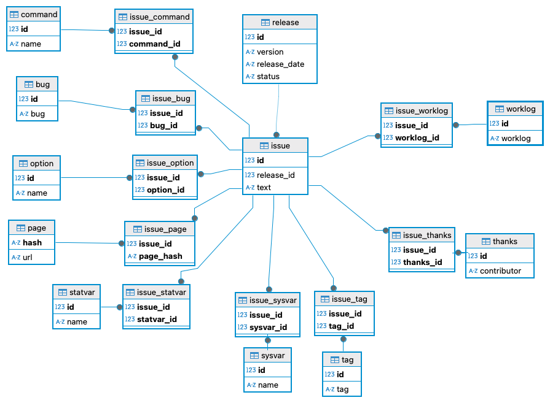

# MySQL Release Notes

This is a Python project (done with uv) that downloads all MySQL release notes,
puts them into a `release_notes` folder,
and then parses all the release notes, pushing them into a database.

It uses click (but we currently actually have no options), SQL Alchemy and mysqlclient to connect to a database.

It generates a schema (not preserving any data),
and then fills the schema with all the release notes that we have.

The schema is a simple encoded star schema: For each release, we have many issues,
and for each issue we have a number of properties.
Properties are not stored as text, but are encoded, and we store only the property id.

Properties are:
- command (issue relates to a command such as `mysqldump`)
- bug (issue bug number)
- option (issue releates to a command line option such as `--alldatabases`)
- page (issue links to a documentation page)
- statvar (issue mentions a status variable)
- sysvar (issue mentions a system variable)
- tag (issue is filed under a headline, or issue text starts with a keyword)
- issue thanks (a contributor is named in a very specific way)
- workload (issue mentions a worklog number)

We can now check how many bugs have been addressed per release,
who contributed the most,
if the number of changes to a subsystem such as Replication changes over time,
or other data.

We can also show what bugs or worklog items an upgrade between any two versions would address,
and which subsystems are touched.

# Issues

The data is extracted from HTML, 
which means the data quality has issues,
and we need a system of fixer callbacks on import.

Specifically:
- The tag extraction needs work.
- sysvar needs to clean up leading double dashes and `-` to `_`, 
  so that `--admin-tls-version` -> `admin_tls_version`.
- command needs cleanup: there are commands with spaces and line breaks, and other random elements.
- `option` is a wild mix of MySQL Options and compiler options.

and of course

- This is a hackish single evening project and the code is ugly.

If you have contributions, please send a MR.

